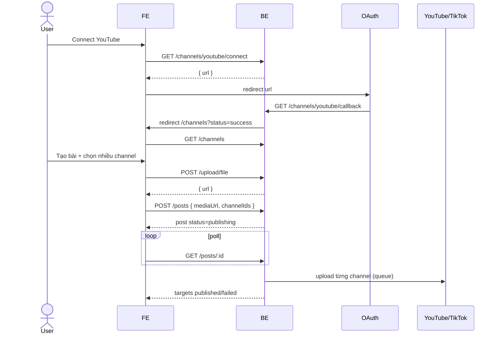

# Flow Frontend — Channels & Auto Post

Base URL: `/api/v1`  
Auth: `Authorization: Bearer <accessToken>`  
Cookie: OAuth connect cần `credentials: 'include'` vì BE set cookie `channel_oauth_nonce`.

Sau OAuth, BE redirect về:

```
{FRONTEND_URL}/channels?platform=youtube|tiktok|shopee&status=success|error&reason=...
```

FE phải có route `/channels` để đọc query này.

---

## 1. Connect channel

### Màn hình

- List channel đã connect: avatar, `displayName`, `username` (YouTube: `@HuyDangzz`, TikTok: username), platform, `connected`.
- Nút Connect cho `youtube` / `tiktok` / `shopee`.
- Disconnect / Delete.

YouTube: `displayName` = tên kênh (Huy Đăng), `username` = handle (`@HuyDangzz`).

### Flow connect

```
User bấm Connect YouTube
  → GET /api/v1/channels/youtube/connect
  → nhận { url }
  → window.location.href = url          // full page, đừng dùng XHR upload sau đó
  → user login Google/TikTok/Shopee
  → BE /api/v1/channels/:platform/callback xử lý
  → redirect FE /channels?platform=youtube&status=success
  → FE đọc query, toast, rồi GET /api/v1/channels để refresh list
```

```ts
// Connect
GET /api/v1/channels/:platform/connect
platform = 'youtube' | 'tiktok' | 'shopee'

Response:
{
  success: true,
  message: 'success',
  data: { url: 'https://accounts.google.com/...' }
}
```

```ts
// Sau redirect về /channels
const platform = searchParams.get('platform')
const status = searchParams.get('status')      // success | error
const reason = searchParams.get('reason')      // denied | failed | invalid_state | already_linked

if (status === 'success') toast('Đã kết nối channel')
if (status === 'error') toast(mapReason(reason))
// clear query rồi fetch lại list
```

| `reason` | UI |
|---|---|
| `denied` | User huỷ OAuth |
| `invalid_state` | Session hết hạn, bấm Connect lại |
| `already_linked` | Channel này đã gắn user khác |
| `failed` | Lỗi chung |

### List / disconnect / delete

```
GET    /api/v1/channels
DELETE /api/v1/channels/:id/disconnect   // giữ record, connected = false
DELETE /api/v1/channels/:id              // xoá hẳn
```

List item:

```ts
{
  id: 1,
  platform: 'youtube',
  connected: true,
  displayName: 'Huy Đăng',
  username: '@HuyDangzz',     // có thể null nếu channel chưa có handle
  email: 'user@gmail.com',
  avatarUrl: 'https://...',
  externalId: '...',
  connectedAt: '2026-09-17T10:00:00.000Z'
}
```

UI rule:

- Chỉ cho chọn channel `connected === true` khi đăng bài.
- Shopee **không đăng video được**. Disable checkbox + tooltip: “Shopee chưa hỗ trợ đăng bài”.
- Channel YouTube/TikTok connect **trước khi có scope upload** thì phải Disconnect rồi Connect lại mới đăng được.

---

## 2. Đăng bài nhiều channel

### Màn hình Create Post

1. Upload video (bắt buộc).
2. Title (bắt buộc, max 100).
3. Description (optional, max 5000).
4. Tags (optional, chip input).
5. Privacy: `private` | `unlisted` | `public` (default FE nên để `private`).
6. Multi-select channel đã connect (YouTube/TikTok), tối thiểu 1.
7. Optional schedule datetime (phải ở tương lai, ISO UTC).
8. Submit.

### Bước 1 — Upload video

```
POST /api/v1/upload/file
Content-Type: multipart/form-data
fields:
  file: File          // video
  folderPath?: string // ví dụ "posts"
```

```ts
{
  success: true,
  data: {
    url: 'https://cdn.../video.mp4',  // dùng field này làm mediaUrl
    key: 'posts/images/...',
    fileName: 'video.mp4',
    size: 12345678
  }
}
```

Giới hạn BE: video public URL, tối đa ~512MB. Input `accept="video/*"`.

Thumbnail optional: upload ảnh rồi gửi `thumbnailUrl`. BE chưa gắn thumbnail lên YouTube.

### Bước 2 — Tạo post

```
POST /api/v1/posts
Authorization: Bearer ...
```

```json
{
  "title": "Hiring backend engineer",
  "description": "Apply now",
  "mediaUrl": "https://cdn.example.com/video.mp4",
  "thumbnailUrl": "https://cdn.example.com/thumb.jpg",
  "tags": ["hiring", "backend"],
  "privacy": "private",
  "channelIds": [1, 2],
  "scheduledAt": "2026-09-18T10:00:00.000Z"
}
```

| Field | Required | Note |
|---|---|---|
| `title` | yes | max 100 |
| `description` | no | max 5000 |
| `mediaUrl` | yes | URL public, `https` |
| `thumbnailUrl` | no | URL public |
| `tags` | no | string[] |
| `privacy` | no | default BE = `private` |
| `channelIds` | yes | id từ `GET /channels`, unique, min 1 |
| `scheduledAt` | no | ISO datetime **trong tương lai** |

Bỏ `scheduledAt` = đăng ngay.

Submit xong **không đợi publish xong**. BE enqueue từng channel. Response có `status: publishing` hoặc `scheduled`, từng `targets[].status` là `pending` / `failed`.

### Privacy mapping

| FE value | YouTube | TikTok |
|---|---|---|
| `public` | public | `PUBLIC_TO_EVERYONE` (app chưa audit thường fail) |
| `unlisted` | unlisted | `SELF_ONLY` |
| `private` | private | `SELF_ONLY` |

TikTok app chưa duyệt Direct Post: chọn `public` dễ fail. Default UI = `private`. Nếu TikTok fail, hiện `targets[].errorMessage`.

---

## 3. List / detail / retry

### List

```
GET /api/v1/posts?page=1&limit=10&status=publishing
```

`page`, `limit` bắt buộc (1–100). `status` optional.

Post status:

| status | UI |
|---|---|
| `scheduled` | Đã lên lịch |
| `publishing` | Đang đăng |
| `published` | Tất cả channel OK |
| `partial` | Một số OK, một số fail |
| `failed` | Tất cả fail |

Target status:

| status | UI |
|---|---|
| `pending` | Chờ worker |
| `publishing` | Đang upload |
| `published` | Có `externalUrl` để mở bài |
| `failed` | Hiện `errorMessage`, nút Retry |

### Detail

```
GET /api/v1/posts/:id
```

Response:

```ts
{
  id: 10,
  title: 'Hiring backend engineer',
  description: 'Apply now',
  mediaUrl: 'https://...',
  privacy: 'private',
  mediaType: 'video',
  status: 'publishing',
  scheduledAt: null,
  createdAt: '2026-09-17T10:00:00.000Z',
  targets: [
    {
      id: 101,
      channelId: 1,
      platform: 'youtube',
      channelName: 'Huy Đăng',
      username: '@HuyDangzz',
      status: 'published',
      externalPostId: 'abc123',
      externalUrl: 'https://www.youtube.com/watch?v=abc123',
      errorMessage: null,
      publishedAt: '2026-09-17T10:02:00.000Z'
    },
    {
      id: 102,
      channelId: 2,
      platform: 'tiktok',
      channelName: 'Huy Dang',
      username: 'huydangzz',
      status: 'publishing',
      externalUrl: null,
      errorMessage: null
    }
  ]
}
```

### Polling (bắt buộc)

Create/retry xong, poll `GET /api/v1/posts/:id` đến khi post `status` ∈ `published | partial | failed`, hoặc mọi target ∈ `published | failed`.

Gợi ý: 2s một lần, tối đa ~2 phút. Upload video lớn có thể > 1 phút.

List page cũng poll các row `publishing` / `scheduled`.

### Retry

Hiện nút Retry khi post `partial` hoặc `failed`, hoặc có target `failed` (YouTube/TikTok còn `channelId`).

```
POST /api/v1/posts/:id/retry
```

Chỉ retry target fail của platform hỗ trợ. Shopee bị bỏ qua. Không có target retry được → `error.post.no-failed-targets`.

Sau retry, poll detail lại.

---

## 4. Screen flow gợi ý

```
/channels
  ├─ list connections
  ├─ Connect → redirect OAuth → back /channels?status=
  └─ Disconnect / Delete

/posts
  ├─ list posts + badge status
  └─ [Tạo bài] → /posts/new

/posts/new
  ├─ GET /channels (filter connected, ẩn/disable Shopee)
  ├─ upload video → lấy mediaUrl
  ├─ form title/description/privacy/schedule
  ├─ multi-select channelIds
  ├─ POST /posts
  └─ redirect /posts/:id (polling)

/posts/:id
  ├─ GET /posts/:id (poll)
  ├─ từng channel: pending/publishing/published/failed
  ├─ published → link externalUrl
  └─ failed → Retry
```

---

## 5. Error BE → UI

| message / key | Khi nào | UI |
|---|---|---|
| `error.channel.not-connected` | channelId sai / chưa connect / disconnect rồi | Bỏ channel, bắt chọn lại |
| `error.channel.account-linked` | OAuth: channel đã gắn user khác | reason=`already_linked` |
| `error.channel.token-failed` | token/refresh hỏng | Bảo connect lại |
| `error.channel.not-configured` | thiếu env platform | Ẩn nút Connect platform đó |
| `error.post.schedule-invalid` | `scheduledAt` không ở tương lai | Validate datetime trên form |
| `error.post.media-failed` | download video fail / quá 512MB / URL không public | Đổi file, upload lại |
| `error.post.platform-unsupported` | Shopee | Không cho chọn Shopee |
| `error.post.publish-failed` | YouTube/TikTok reject | Hiện `targets[].errorMessage` |
| `error.post.no-failed-targets` | Retry khi không còn fail hợp lệ | Ẩn nút Retry |
| `error.post.not-found` | sai id / không phải của user | 404 |

Lỗi từng kênh nằm ở `targets[].errorMessage` (message API YouTube/TikTok), không phải lúc nào cũng là error key.

---

## 6. Checklist FE

- [ ] Route `/channels` đọc `platform`, `status`, `reason`
- [ ] Connect dùng full-page redirect, axios/fetch `withCredentials: true`
- [ ] List hiện `displayName` + `username`
- [ ] Chỉ select channel `connected === true` và `platform !== 'shopee'`
- [ ] Upload video trước, submit `mediaUrl` public
- [ ] `channelIds.length >= 1`
- [ ] `scheduledAt` optional, phải > now
- [ ] Sau create/retry: poll detail đến khi xong
- [ ] Target `published` có link `externalUrl`
- [ ] Target `failed` có Retry + error message
- [ ] YouTube/TikTok cũ: hướng dẫn Disconnect → Connect lại để cấp quyền upload

---

## 7. Sequence


